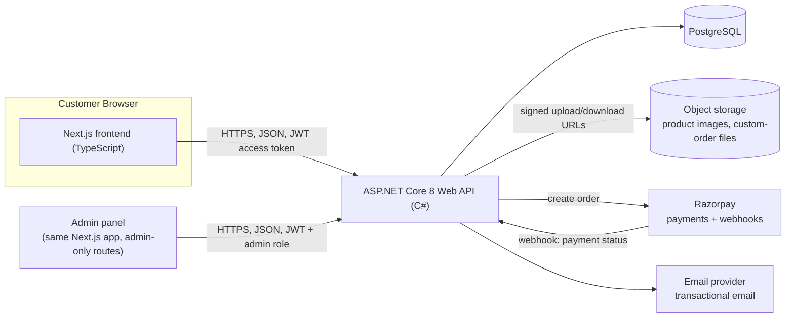

# Architecture

See `docs/technology-stack.md` for why each piece was chosen.

## Overview

Single frontend app (Next.js) serves both the public storefront and the admin panel (behind auth + role check), talking to a single backend API. Two deployables total: frontend + backend. Database, storage, payments, and email are managed third-party services, not self-hosted.

## Trust boundaries

- **Browser → API** is the primary untrusted boundary. Every request is treated as attacker-controlled: validated server-side regardless of what the frontend already validated.
- **Razorpay webhook → API**: untrusted until the signature is verified. Never act on a webhook payload before verifying it was actually sent by Razorpay.
- **Admin panel**: same untrusted boundary as the customer app — an admin route is only as safe as its server-side authorization check. The frontend hiding a button is not a control.
- **File uploads** (product images, custom-order reference files): untrusted content. Validated by content-sniffing, stored outside any path that gets executed, served with a restrictive `Content-Disposition`.

## Failure modes

| Dependency down | Behaviour |
|---|---|
| Database | API returns 503 on `/health/ready`; requests fail cleanly with the standard error envelope, not a stack trace. |
| Razorpay | Checkout shows a clear "payment temporarily unavailable, try again shortly" state; no order is created without a confirmed payment intent. |
| Email provider | Order/payment still succeeds; email queued and retried with backoff. Failure to send is logged, never blocks the user-facing flow. |
| Object storage | Product images fail to load (show a placeholder); checkout/payment is unaffected since it doesn't depend on storage. |

Nothing in the critical path (place order, pay, receive confirmation) should hard-fail because a secondary dependency (email, storage) is unavailable.

## Correlation IDs

Every incoming request gets a correlation ID (generated if not supplied via header). It flows through: structured logs, the `correlationId` field in the error envelope (see `docs/api.md`), and any background job triggered by that request (e.g. sending a confirmation email). Lets us trace "customer says their order failed" to the exact log lines.

## Time handling

- Store all timestamps in UTC in the database.
- Convert to IST only at the presentation layer (API response formatting or frontend display).
- Never use server local time in business logic (e.g. "is this quote still valid" compares UTC instants, not wall-clock strings).

## Money handling

- All amounts stored as **integer paise** (never floating point).
- Currency code (`INR`) stored alongside every amount field, even though we only support INR today — avoids a painful migration if that ever changes.
- Razorpay is the source of truth for whether a payment succeeded; the app's local order state is a projection of Razorpay's webhook events, not an independent judgment.

## Idempotency

- **Razorpay webhooks**: processed idempotently keyed on Razorpay's event ID — a webhook that arrives twice (which Razorpay explicitly says can happen) must not create a duplicate order or double-fulfill.
- **Order creation / payment capture endpoints**: accept an idempotency key from the client so a retried request (e.g. flaky mobile network) doesn't create two orders.
- Raw webhook payloads are stored as received, before any processing, so a bug in processing logic doesn't lose the source data.

## Concurrency

- **Stock/inventory**: two customers buying the last unit of a miniature at the same time is the main collision case. Use a database-level check (row lock or conditional update `WHERE stock > 0`) at order-creation time, not an application-level read-then-write.
- **Admin editing a product while it's mid-purchase**: optimistic concurrency via a row version column on `products`; a stale write is rejected rather than silently overwritten.
- **Custom order quoting**: only one quote is "active" per request at a time; accepting a quote is a single atomic transition, guarded against double-accept (e.g. two browser tabs).

## Environments

Development (local, Docker Compose) → Staging (test-mode Razorpay keys, sandboxed email) → Production. See `docs/deployment.md` (written at M9) for promotion process.
